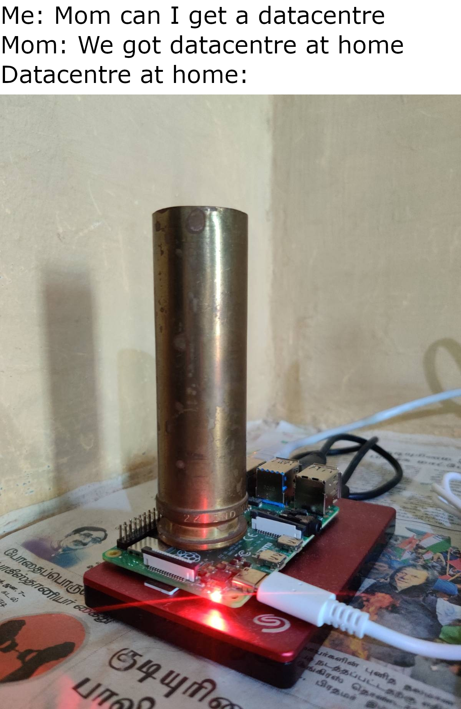

# beevee.ga-configs

This repository is to serve as a documentation/tutorial/blog of how I set up a self-hosted home server. This repo will also contain docker-compose files and some config files. 

## DISCLAIMER: 
- A basic understanding of Linux is assumed by this README. Don't just copy-paste the commands, read and understand them first. For example: You'll need to change the domain name.
- This is my learning experience and I may have made some mistakes, so feel free to open an issue on Github or contact me if you find any. 
- I'm not responsible for any loss that may happen from following my guide. Please refer to other guides and documentation (Even 1st party docs to be extra cautious) as well to be sure. 
- I've given away information for educational purposes only. Please don't run any attacks on my server using this information. Thanks.
---

## Device
### Hardware
Item | Cost | Needs Replacement?
---|---|---
Raspberry Pi 4 Model B 8GB RAM | ₹ 6,799.00 | New
Raspberry Pi 15.3W Type-C Power Supply | ₹ 708.00 | New
Samsung EVO Plus 64GB microSDXC | ₹699.00 | New
40mm brass canister | ₹0.00 | Yes
WD My Book 4TB External Hard Drive | ₹6,999.00 | New

[RaspberryPi](https://www.raspberrypi.org/) is a very small and cheap single-board computer that has pretty good performance for a low power device. I could've used some old laptop for this, but it would have loud fans, produce a lot of heat and would be difficult to hide. 

This RPi is enough for me as I don't expect more than 10 instances to be connected at a single time. I've gone went with 8GB of RAM since I'm running quite a few heavy services. If you plan to use it for production work, a dedicated server or a cluster of Pi's with load balancing might be better, depending on your needs. Additionally, RPi uses ARM architecture so some applications may not be supported. The requirement of heatsinks or fans is dependent on the climate of your location and your workloads.

The SD card serves as the OS boot drive and the hard disk serves as the bulk storage. The SD card is honestly not required and at such high capacity as newer RPi bootloaders support USB boot and SD cards are said to have lower endurance. The internal hard-disk used in My Book is WDC WD40EDAZ-11U78B0. This appears to be a enterprise class drive but is SMR. For my usecase, since I won't be doing much writes nor using ZFS raid, it shouldn't be an issue. 

### Software
#### [Ubuntu Server 20.04 LTS](https://ubuntu.com/download/raspberry-pi)
The official Raspberry Pi OS only has a 32-bit stable release. ARM32 would have lower performance (on RPi4) and ARM64 is supported by more applications, so, I  wanted a 64 bit OS. I personally prefer Debian more as a server OS, however, Ubuntu is also not a bad OS. It is also officially supported by RPi. Although, I've uninstalled snaps by following this [guide](https://techwiser.com/remove-snap-ubuntu/) xD.

Installing the OS is different from regular linux, where the filesystem is directly flashed to the microsd. I used the [rpi-imager](https://www.raspberrypi.org/software/) for this.

Additionally, I created a new user account "bv" with sudo privileges and switched to login only via public-key for ssh. 

#### [Docker](https://docs.docker.com/engine/)
Docker is a containerization technology, a really cool concept. In a vague sense, these containers are like virtual machines, however, they use OS-level virtualization to have minimal overhead. Docker is [not inherently secure as VM](https://opensource.com/business/14/7/docker-security-selinux) and proper configuration and updates are necessary for security. I'm running all my web services using these containers.

I installed docker using the following commands as per the [installation guide](https://docs.docker.com/engine/install/ubuntu/):
```bash
# Install pre-requisites
sudo apt-get install apt-transport-https ca-certificates curl gnupg lsb-release
 # Add docker's gpg key to keyrings
curl -fsSL https://download.docker.com/linux/ubuntu/gpg | sudo gpg --dearmor -o /usr/share/keyrings/docker-archive-keyring.gpg
# Add docker repo as additional source for apt
echo "deb [arch=arm64 signed-by=/usr/share/keyrings/docker-archive-keyring.gpg] https://download.docker.com/linux/ubuntu $(lsb_release -cs) stable" | sudo tee /etc/apt/sources.list.d/docker.list > /dev/null
# Refresh repositories and install docker
sudo apt-get update && sudo apt-get install docker-ce docker-ce-cli containerd.io docker-compose
```
Some of the useful docker commands are:
```bash
# Start containers (stack) defined in the docker-compose.yml file or apply configuration changes from docker-compose.yml file
cd folder/with/compose/file
sudo docker-compose up -d
# Update containers and restart them and remove old base images
cd folder/with/compose/file
sudo docker-compose pull && sudo docker-compose up -d & sudo docker image prune
# See running containers
sudo docker ps #-a (if you want to see stopped as well)
# Manage existing containers 
sudo docker <start/stop/restart> <container_name>
# See logs of container (stdout & stderr)
sudo docker logs <container_name>
# Execute a commmand inside a container, Use bash if you want a shell 
sudo docker exec -it <container_name> <command/bash>
```

---
## Domain
I got my domain from [Freenom](https://www.freenom.com). They provide free domains like example.tld where tld ∈ {tk,ml,ga,cf,gq}. Note: Add the .tld of your choice when searching, else, it would say "not available" when clicking "get it now".

However, freenom has been known to be [scammy](https://hostingpill.com/domain-registrar/freenom/) and I strongly suggest against using freenom for any site that'll get heavy traffic or buying from them.

### DNS Configuration
I have a dynamic IP (not shared). I want the domain to point to my new IP whenever it changes, so I'm using [freenom-script](https://github.com/mkorthof/freenom-script) for this. I set it up with the following steps:
```bash
# Download and Install the script
git clone https://github.com/mkorthof/freenom-script.git &&
cd freenom-script && sudo make install
# Edit the configuration file
# Add `freenom_email` and `freenom_passwd` with the email and password used while registering the domain and comment out MTA (email service not configured)
sudo vim /usr/local/etc/freenom.conf
# Enable auto-updating IP entry
sudo systemctl enable --now freenom-update@<domain>.timer
# [Optional] Enable auto-renew (not tested yet as renewal time hasn't come)
sudo systemctl enable --now freenom-renew@<domain>.timer
```

I used the freenom client area (https://my.freenom.com/clientarea.php?managedns=domain&domainid=numbers) to add the following entries. Change them as per your domain

Name | Type | TTL | Target
---|---|---|---
<empty> | A | 3600 | ~~IP~~ (handled by script)
BITWARDEN | CNAME | 3600 | beevee.ga
COLLABORA | CNAME | 3600 | beevee.ga
JELLYFIN | CNAME | 3600 | beevee.ga
NEXTCLOUD | CNAME | 3600 | beevee.ga
PHOTOPRISM | CNAME | 3600 | beevee.ga
PIHOLE | CNAME | 3600 | beevee.ga
TRANSMISSION | CNAME | 3600 | beevee.ga
WWW | CNAME | 3600 | beevee.ga

What the columns mean in simple terms are as follows. [Detailed version here](https://www.cloudflare.com/learning/dns/dns-records/). 
- Name: Points to subdomains of your domain, empty just points to your domain
- Type: 
    - A : This points to an IPv4 address
    - AAAA: This points to an IPv6 address (if yours is)
    - CNAME: This points to other domain/subdomain (here it points to my own domain)
- TTL: How long to cache the DNS entry (I used the default of 1hr)
- Target: Where the entry should point to

---
## Networking
The RPi is connected via ethernet to my router. I set up a static LAN IP of 192.168.0.101 on my router for the RPi. On the Pi, I created a custom docker bridge network for the web apps with `sudo docker network create webserver`

### Port Forwarding
I set up the following port forwarding on my router as well as my modem. My modem doesn't support bridged networking and setting the router in DMZ doesn't work either. This setting is usually called virtual servers/applications.  

Name | Interface | Protocol | Private | Public
--- | --- | --- | --- | ---
WebsiteHTTP	| All | TCP | IP: 192.168.0.101 Port: 80 | IP: Port: 80  
WebsiteHTTPS | All | TCP | IP: 192.168.0.101 Port: 443 | IP: Port: 443
Transmission | All | TCP/UDP | IP: 192.168.0.101 Port: 51413 |IP: Port: 51413
Wireguard | All | UDP | IP: 192.168.0.101 Port: 51820 | IP: Port: 51820

### Firewall
It is recommended to use a firewall even when not exposed to the internet. I used ufw with the default state set to deny incoming. The following entries were added using the commands below that. [Full manual here](https://manpages.ubuntu.com/manpages/focal/en/man8/ufw.8.html).

To | Action | From | Comments(not part of ufw)
-- | ------ | ---- | ---
22/tcp | LIMIT | Anywhere | for SSH
53 | ALLOW | 192.168.0.0/24 | for DNS (PiHole) in LAN
80/tcp | ALLOW |Anywhere | for HTTP redirect (SWAG)
443/tcp | ALLOW | Anywhere | for HTTPS (SWAG)
51413 | ALLOW | Anywhere | for Transmission
51820/udp | ALLOW | Anywhere | for Wireguard
port/proto (v6) | same as IPv4 | same as IPv4 | same as IPv4
```bash
sudo ufw default deny # block all incoming by default
sudo ufw limit 22/tcp # for rate limiting ssh
sudo ufw allow <port>/<tcp/udp/any> # allow connections to this port
sudo ufw allow 192.168.0.0/24 to <tcp/udp/any> port <port> # allow connection only from LAN to this port
sudo ufw enable # enable the firewall
```

---
## Services
If you're using my compose-files, I recommend starting the SWAG container first. If you don't want it, you can expose the ports by referring to the respective docs. DO NOT EXPOSE THESE PORTS PUBLICLY. Before using them take note of the follwing:
- The compose-files contain additional comments, so check them before following the instruction below
- You don't have to remove the comments in the docker-compose.yml files, but you'll need to remove the comments in the .env files currently
- The UID and GID used by these are 1001, you can find those for your user by `id`
- While most of the configuration and data volumes are relative to the compose file, some data volumes use long paths involving home directory which needs to be changed (`~/path` is not accepted by docker)
- Make sure to create the passed folders or files before starting the containers with `mkdir <folder_name>` or `touch <file_name>` as the user to avoid permission errors which would result in container boot-loops

### Exposed
#### [SWAG](https://github.com/linuxserver/docker-swag)
SWAG (Secure Web Access Gateway) is an image containing Nginx + Certbot + fail2ban. Nginx can be used as a webserver as well as a reverse proxy. Certbot provides SSL (HTTPS) certificates that are validated by Let's Encrypt (or ZeroSSL) and performs it's renewal automatically. One must never expose ports publicly for web-services and a reverse proxy with HTTPS is necessary for such cases. Look for some other docker image (like standalone Nginx) if you plan to use your own external CA authorized or self signed (you monster) certificates.

**Instructions:**
- Change the email, url and subdomains (comma seperated) in the [.env](./compose-files/swag/.env) file 
- Start the container with `sudo docker-compose up -d`
- Add the reverse proxy configurations in [proxy-confs](./swag/swag_configs/nginx/proxy-confs/). You can rename the app.subdomain.conf.sample to app.subdomain.conf to activate them. I've added additional modifications/headers to the files I use to improve security and I've uploaded them. You'll need the additional [local.conf](./swag/swag_configs/nginx/local.conf) and [x-secure.conf](./swag/swag_configs/nginx/x-secure.conf) if so
- [x-secure.conf](./swag/swag_configs/nginx/x-secure.conf) contains HTTP headers that are meant to increase security and mitigate cross-site scripting attacks. They are commented out in [ssl.conf](./swag/swag_configs/nginx/ssl.conf) but since some web-apps implement their own headers, this was moved to a seperate file to enable on a case basis
- [local.conf](./swag/swag_configs/nginx/local.conf) contains configurations to limit only to LAN
- (Optional) I've enabled HSTS by removing the comment-out in [ssl.conf](./swag/swag_configs/nginx/ssl.conf) and submited it for [preload](https://hstspreload.org/) afterwards. This ensures that all connections to the domain and subdomains are strictly HTTPS by hard-coding it every major browser. But if for some reason you lose HTTPS, the browser will refuse to load the 
- I've also enabled opt out of Google's FLoC by removing the comment-out in [ssl.conf](./swag/swag_configs/nginx/ssl.conf) for that as well
- Restart the container with `sudo docker restart swag` for the changes to take effect

**To-Do:** 
- [x] fail2ban for services
- [ ] CSP header configuration
- [x] Limit to local for certain subdomains
- [x] ~~Reduce logs~~ (botattack flooding logs taken care by f2b)

**Links:** [Docker Image Docs](https://docs.linuxserver.io/images/docker-swag), [1st-party Docs](https://docs.linuxserver.io/general/swag), [Nginx Docs](https://nginx.org/en/docs/), [HTTP Header Docs](https://developer.mozilla.org/en-US/docs/Web/HTTP/Headers), [Header Configuration Scanner](https://observatory.mozilla.org/)

#### [Nextcloud](https://www.nextcloud.com/)
Nextcloud is a self-hosted cloud drive similar to google drive/onedrive and provided functionalities like file storage, contacts, calendar, notes, etc. It allows uploading, downloading and sharing files on the nextcloud server as well as automatic folder backup, calendar and contact sync. 

**Instructions:**
- Set the password for database root, database user in the [.env](./compose-files/nextcloud/.env) file 
- Start the container with `sudo docker-compose up -d`
- The default configuration of the mariadb image is different from that recommended for nextcloud. Please change the configurations to avoid DATA LOSS. Do this before connecting the database. For additional safety, stop nextcloud with `sudo docker stop nextcloud`
- Change the transaction-isolation and binlog_format as shown in the uploaded [custom.cnf](./nextcloud/mariadb-config/custom.cnf) `
- [Optional] If you want emoji support, change character-set-server and collation-server as shown in the uploaded [custom.cnf](./nextcloud/mariadb-config/custom.cnf)
- Restart the database with `sudo docker restart nc_db 
- Verify the changes in a mysql shell and modify the database if required:
```mysql
# Open mysql shell by entering root password for 
# You'll be dropped into the mysql shell (MariaDB [(none)]>)
sudo docker exec -it nc_db mysql -p
# Query for changed parameters
# Should return | READ-COMMITTED | ROW | 
SELECT @@tx_isolation, @@binlog_format;
# [Optional] Change the database character set and collation
ALTER DATABASE nextcloud CHARACTER SET utf8mb4 COLLATE utf8mb4_general_ci;
# [Optional] Change to database
USE nextcloud;
# [Optional] Query for changed character set and collation 
# Should return | utf8mb4 | utf8mb4_general_ci |
SELECT @@character_set_database, @@collation_database;
# Close shell
exit
```
- Start nextcloud with `sudo docker start nextcloud`
- Perform the first time setup by going to https://nextcloud.domain and doing the following:
    - Click Storage & database
    - Switch database to MySQL/MariaDB 
    - Enter the database credentials and change Database host to nc_db:3306
    - Uncheck install recommended app, we shall do it manually as this gives problems
    - Enter username and password for admin account
- Some configurations cannot be changed with the web-ui and have to be done by adding entries for memcache.distributed, filelocking.enabled, memcache.locking, redis, overwritehost, overwriteprotocol , default_language, default_locale, default_phone_region in [config.php](./nextcloud/nextcloud-config/www/nextcloud/config/config.php). DO NOT replace with the file I've uploaded as other entries are redacted, it is ONLY FOR REFERENCE
- Restart nextcloud with `sudo docker restart nextcloud` and login as your user
- Verify that there are no problems at https://nextcloud.domain/settings/admin/overview and https://nextcloud.domain/settings/admin/logging (there may be some log entries)
- Apps can be added at https://nextcloud.domain/settings/apps. I've added [Contacts](https://apps.nextcloud.com/apps/contacts), [Calendar](https://apps.nextcloud.com/apps/calendar), [Notes](https://apps.nextcloud.com/apps/notes), [Task](https://apps.nextcloud.com/apps/tasks), [Talk](https://apps.nextcloud.com/apps/spreed), [Mail](https://apps.nextcloud.com/apps/mail), [Forms](https://apps.nextcloud.com/apps/forms), [Collabora Online](https://apps.nextcloud.com/apps/richdocuments), [External storage support], [Two-Factor TOTP Provider](https://apps.nextcloud.com/apps/twofactor_totp)
- Settings, including that of the installed apps can accessed at https://nextcloud.domain/settings/user

**Nextcloud Links:** [Docker Image Docs](https://docs.linuxserver.io/images/docker-nextcloud), [1st-party Docs](https://docs.nextcloud.com/server/latest/admin_manual/), [Client Download](https://nextcloud.com/install/#install-clients)

**Mariadb Links:** [Docker Image Docs](https://docs.linuxserver.io/images/docker-mariadb), [1st-party Docs](https://mariadb.org/documentation/), [SQL Statements](https://mariadb.com/kb/en/sql-statements/), [Nextcloud DB-config Docs](https://docs.nextcloud.com/server/latest/admin_manual/configuration_database/linux_database_configuration.html), [Nextcloud 4-byte support](https://docs.nextcloud.com/server/latest/admin_manual/configuration_database/mysql_4byte_support.html)

**Redis Links:** [Docker Image Docs](https://hub.docker.com/_/redis/), [1st-party Docs](https://redis.io/documentation), [Nextcloud Caching Docs](https://docs.nextcloud.com/server/latest/admin_manual/configuration_server/caching_configuration.html), [Nextcloud Caching Docs](https://docs.nextcloud.com/server/latest/admin_manual/configuration_files/files_locking_transactional.html)

#### [Collabora](https://collaboraoffice.com/code)
Collabora is a self-hosted web-based office suite similar to Google Docs/Office Online. I'm using this as a seperate container because the nextcloud image I'm using doesn't support the one from app store. 

**Instructions:**
- Set the admin username and password in the [.env](./compose-files/collabora/.env) file  
- Start the container with `sudo docker-compose up -d`
- Verify if collabora started by checking if you get 'OK' in https://collabora.domain/
- Connect to it with nextcloud. This cannot be used STANDALONE (I was so confused by this)
    - Go to https://nextcloud.domain/settings/admin/richdocuments
    - Select use your own server
    - In URL (and Port) of Collabora Online-server, put https://collabora.domain/ and save
    - Make sure you get a green tick mark it
    - Open any document in your nextcloud
- Currently, the only way to use additional fonts (*cough* microsoft fonts *cough*) without building your own image is to mount as given in the compose file. This will break whenever the version number changes, but none of the other methods I've tried worked.

**To-Do:** 
- [ ] Merge with nextcloud stack

**Links:** [Docker Image Docs](https://sdk.collaboraonline.com/docs/installation/CODE_Docker_image.html), [Better 3rd-party Doc](https://project.dancier.net/documentation/howto/nextcloud/index.html), [Additional Fonts Forum post](https://help.nextcloud.com/t/collabora-font-issues/26126/4)

#### [Jellyfin](https://jellyfin.org/) 
Jellyfin is a self-hosted media server similar to plex (also selfhosted but not fully open-source) and could be a replacement for streaming services like netflix/spotify for content that you *own*. Do note that the content that you pay for does not necessarily mean you *own* it due copyrights and terms, so use them with a media server at your own risk. Jellyfin also downloads metadata/images for your media and supports SyncPlay (watch together).

**Instructions:**
- Start the container with `sudo docker-compose up -d`
- Follow first-time setup in https://jellyfin.domain/ and creating new user and libraries 
- Further configurations can be done at https://jellyfin.domain/web/index.html#!/dashboard.html

**To-Do:** 
- [ ] Hardware acceleration with arm64 non functional

**Links:** [Docker Image Docs](https://docs.linuxserver.io/images/docker-jellyfin), [1st-party Docs](https://jellyfin.org/docs/), [Client Download](https://jellyfin.org/clients/)

#### [Vaultwarden](https://github.com/dani-garcia/vaultwarden)
Bitwarden is an open source password manager alternative to LastPass/Dashlane that offers self-hosting as well. Vaultwarden is a rewrite of the Bitwarden server API in Rust and is prefered by non-enterprise self-hosters due to its lower resource demand. 

**Instructions:**
- Set the admin password (recommended: `openssl rand -base64 48`) in the [.env](./compose-files/vaultwarden/.env) file 
- Start the container with `sudo docker-compose up -d`
- Go to https://bitwarden.domain/admin > users and invite your user by entering an email address. You will not get an email (unless you've set up a SMTP server) but an account can be created regardless
- Alternatively, you can temporarily set SIGNUPS_ALLOWED=true in the [docker-compose.yml](./compose-files/vaultwarden/docker-compose.yml) file and skip the above step
- Go to https://bitwarden.domain/#/register and create an user with the same email address
- You can use the web-vault and apps with this user

**Links:** [Docker Image Docs](https://github.com/dani-garcia/vaultwarden/wiki/), [Bitwarden Docs](https://bitwarden.com/help/), [Client Download](https://bitwarden.com/download/)

#### [Photoprism](https://photoprism.app/)
Photoprism is a self-hosted photo storage alternative to Google Photos. It has a tensorflow model to scan and index, as well as facial recognition. This allows it to have the search functionality similar to that of Google Photos. It's under heavy development among all the services I'm running. 

**Instructions:**
- Set the password for database root, database user and photoprism login in the [.env](./compose-files/photoprism/.env) file 
- Start the container with `sudo docker-compose up -d`
- The default configuration of the mariadb image is different from that recommended for photoprism. Please change the configurations to avoid DATA LOSS. Do this before connecting the database. For additional safety, stop photoprism with `sudo docker stop photoprim`
- Change the character-set-server, collation-server, transaction-isolation, max_connections, innodb_rollback_on_timeout, innodb-lock-wait-timeout as shown in the uploaded [custom.cnf](./photoprism/mariadb-config/custom.cnf) and restart the database with `sudo docker restart pp_db`
- The changed configurations can be verified and the created database can be altered as follows:
```mysql
# Open mysql shell by entering root password for 
# You'll be dropped into the mysql shell (MariaDB [(none)]>)
sudo docker exec -it pp_db mysql -p
# Query for changed parameters
# Should return | READ-COMMITTED | 512 | 0 | 120 |
SELECT @@tx_isolation, @@max_connections, @@innodb_rollback_on_timeout, @@innodb_lock_wait_timeout;
# Change the database character set and collation
ALTER DATABASE photoprism CHARACTER SET utf8mb4 COLLATE utf8mb4_unicode_ci;
# Change to database
USE photoprism;
# Character set and collation 
# Should return | utf8mb4 | utf8mb4_unicode_ci |
SELECT @@character_set_database, @@collation_database;
# Close shell
exit
```
- Start photoprism with `sudo docker start photoprism`
- Go to https://photoprism.domain, login and upload photos
- Indexing can be done at https://photoprism.domain/library, 


**Photoprism Links:** [1st-party Docs](https://docs.photoprism.org/)

**Mariadb Links:** [Docker Image Docs](https://docs.linuxserver.io/images/docker-mariadb), [1st-party Docs](https://mariadb.org/documentation/), [SQL Statements](https://mariadb.com/kb/en/sql-statements/)

#### [Wireguard](https://www.wireguard.com/)
Wireguard is a VPN protocol that is relatively new. It aims to be fast and simple while providing enough security. I found this to be much easier to configure than (my failed bare-metal attempt at) OpenVPN. Using a VPN one can access the LAN only services and devices on the network from anywhere securely as well as to overcome censorship firewalls and resist eavesdropping in public Wi-Fi. 

**Instructions:**
- Change the domain name and add  names to peers (space-seperated) in the [.env](./compose-files/wireguard/.env) file 
- Start the container with `sudo docker-compose up -d`
- The generated client configurations are located at wireguard-config/peer_name
- The .conf file can be imported to client or the .png can be scanned if on a mobile client and connected

**To-Do:** 
- [ ] Split tunneling for captive portals. Connecting from IISER Internet disconnects after initial handshake

**Links:** [Docker Image Docs](https://docs.linuxserver.io/images/docker-wireguard), [1st-party Docs](https://www.wireguard.com/quickstart/), [Client Download](https://www.wireguard.com/install/)

### Internal
#### [PiHole](https://pi-hole.net)
PiHole is a DNS based network-wide ad-blocker. It can be used to block ads and trackers on "smart devices" which do not support ad-blockers (even windows telemetry to some extent). It does not replace a dedicated (browser) ad-blocker and compliments it instead.

**Instructions:**
- Start the container with `sudo docker-compose up -d`
- The password is created by the image when it is first started (either as a random string or from set environment variable). `sudo docker exec -it pihole pihole -a -p` can be used to set a new password later
- Add the IP of RPi as the DNS server on the router. You'll have to use DHCP (requires other configurations) otherwise.
- If you cannot access the web-ui at https://pihole.domain/admin or don't want to expose with global subdomain record, you can expose the web-ui port locally instead by removing the comment-out
- I've added the same [DNS records](#dns-configuration) appended with the domain in the local dns records, https://pihole.domain/admin/dns_records.php and https://pihole.domain/admin/cname_records.php for A and CNAME records respectively. This allows the use of domain URLs internally even without internet
- Adlists can be added in https://pihole.domain/admin/groups-adlists.php. Currently I'm using the [default](https://raw.githubusercontent.com/StevenBlack/hosts/master/hosts) and [Developer Dan's Ads & Tracking](https://www.github.developerdan.com/hosts/lists/ads-and-tracking-extended.txt). After adding a list, gravity database have to be updated at https://pihole.domain/admin/gravity.php
- Whitelist can be added to allow domains in adlists so that some functionality isn't broken in https://pihole.domain/admin/groups-domains.php?type=white. I've currently only added [GFonts](fonts.gstatic.com)
- Upstream DNS provider can be set in https://pihole.domain/admin/settings.php?tab=dns. I'm currently using Cloudflare's DNS Server

**To-Do:** 
- [ ] Additional blocklists?
- [ ] Unbound for upstream dns

**Links:** [Docker Image Docs](https://github.com/pi-hole/docker-pi-hole#readme), [1st-party Docs](https://docs.pi-hole.net/), [Whitelist Suggestions](https://discourse.pi-hole.net/t/commonly-whitelisted-domains/212)

#### [Transmission](https://transmissionbt.com)
Transmission is a BitTorrent client for torrenting (i.e downloading and sharing Linux ISOs). It has good web-ui remote (using flood currently) for adding and managing torrents and works in the same way as a desktop client. Combustion web-ui is better suited if using mobile primarily.

**Instructions:**
- Set username and password in the [.env](./compose-files/transmission/.env) file 
- Start the container with `sudo docker-compose up -d`
- Access the web-ui at https://transmission.domain/transmission/web/ 

**To-Do:** 
- [x] Web-Auth problems. ~~The webpage is cached sometimes and doesn't request for password leading to an unusable webpage. Cannot use password manager's autofill.~~ Due to invalid https certificate

**Links:** [Docker Image Docs](https://docs.linuxserver.io/images/docker-transmission), [Arch Wiki Entry](https://wiki.archlinux.org/title/Transmission), [Android Remote App](https://github.com/equeim/tremotesf-android)

---
## Meme


---
## To-do
- [ ] Finish writing README
- [x] Sanitise compose files of sensitive information
- [x] Upload docker-compose files
- [ ] Upload config files
- [x] ~~Auto-update script~~ using diun
- [x] Move data to new hard disk
